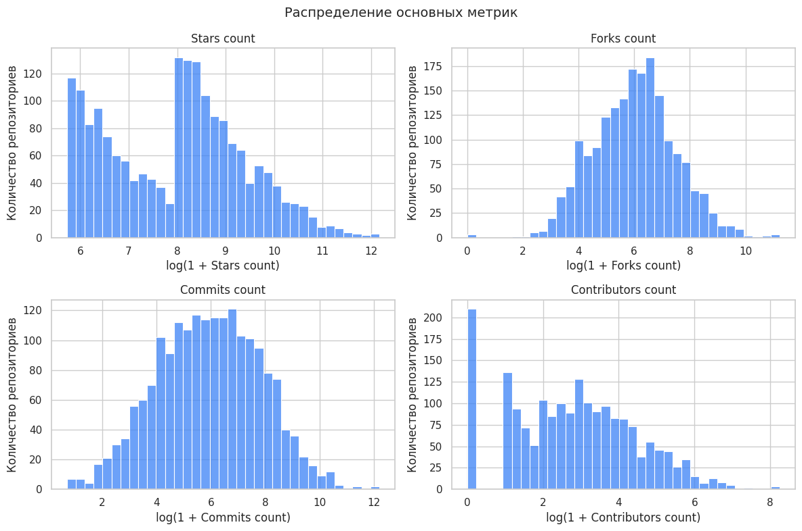
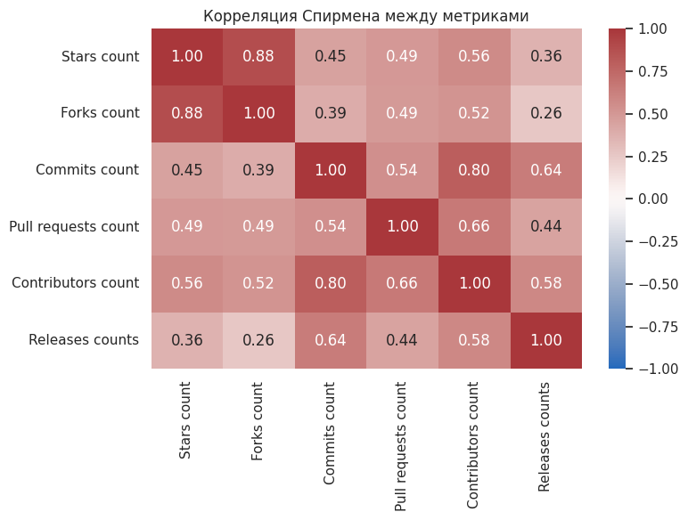
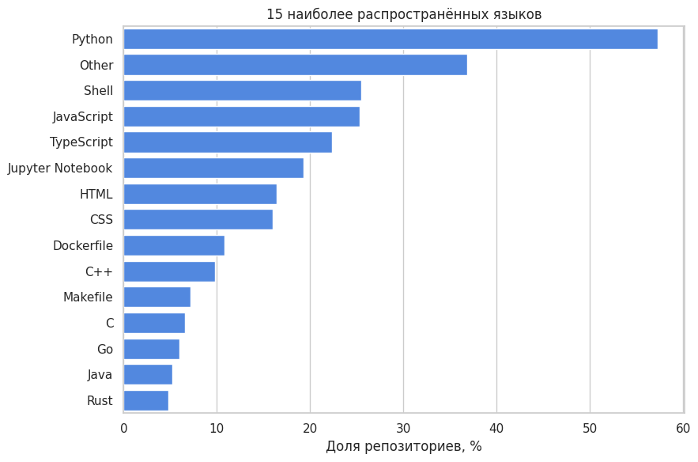

# EDA GitHub-репозиториев по темам AI и ML

Учебный проект по разведочному анализу данных. В работе исследуется снимок популярных GitHub-репозиториев из поисковой выдачи по темам AI и ML: распределение метрик активности, связи между звёздами и форками, используемые языки и термины в описаниях.

## Цель и задачи

- объединены и очищены две исходные выгрузки;
- обработаны пропуски, дубликаты и списки языков;
- изучены распределения звёзд, форков, коммитов и числа контрибьюторов;
- рассчитана ранговая корреляция Спирмена между метриками;
- показаны наиболее распространённые языки;
- проведено описательное сравнение проектов с актуальными AI-терминами в описании.

Основной результат представлен в [`notebooks/github_ai_ml_analysis.ipynb`](notebooks/github_ai_ml_analysis.ipynb). Ноутбук содержит ход анализа, визуализации, выводы и описание ограничений исследования.

## Визуализации

Распределения основных метрик после логарифмического преобразования:



Ранговая корреляция Спирмена между показателями активности:



Доля репозиториев, в которых встречаются наиболее распространённые языки:



## Структура

```text
assets/                изображения для README
notebooks/             основной ноутбук
raw_parsed_data/       отдельные выгрузки по запросам AI и ML
raw_concat_dataset/    объединённые исходные данные
new_index_dataset/     результат очистки и расчёта признаков
requirements.txt       зависимости проекта
```

## Запуск

Для запуска нужен Python 3.9 или новее.

```bash
python -m venv .venv
source .venv/bin/activate
pip install -r requirements.txt
jupyter notebook notebooks/github_ai_ml_analysis.ipynb
```

Ноутбук можно запускать как из корня репозитория, так и из папки `notebooks`: путь к данным определяется автоматически. Все необходимые CSV уже включены в проект.

Для проверки без открытия браузера:

```bash
jupyter nbconvert \
  --to notebook \
  --execute notebooks/github_ai_ml_analysis.ipynb \
  --output /tmp/github_ai_ml_analysis.executed.ipynb
```

## Данные и ограничения

В выборке находятся репозитории, полученные из поисковой выдачи GitHub. Это не случайная выборка всего GitHub, а метрики представляют состояние проектов на момент сбора данных. Поэтому результаты нельзя переносить на все open-source проекты или трактовать как причинные зависимости.

Исходный сбор выполнялся через HTML-страницы GitHub. Такой подход зависит от структуры сайта и может пропускать отдельные значения. Для дальнейшего развития проекта лучше использовать GitHub API и сохранять дату каждой выгрузки.

## Результаты анализа

- Метрики активности имеют длинный правый хвост: небольшая группа известных проектов заметно отличается от основной выборки.
- Среди рассмотренных показателей особенно явно связаны звёзды и форки.
- Многие проекты используют несколько языков; Python входит в число наиболее распространённых.
- Сравнение описаний по AI-терминам носит разведочный характер и не доказывает, что формулировка описания влияет на популярность.

## Использованные инструменты

Python, pandas, NumPy, Matplotlib, seaborn и Jupyter Notebook.
